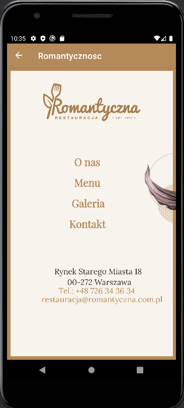
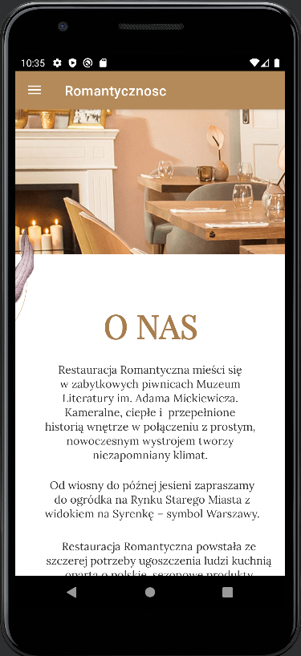
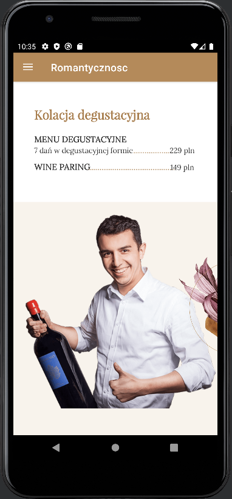
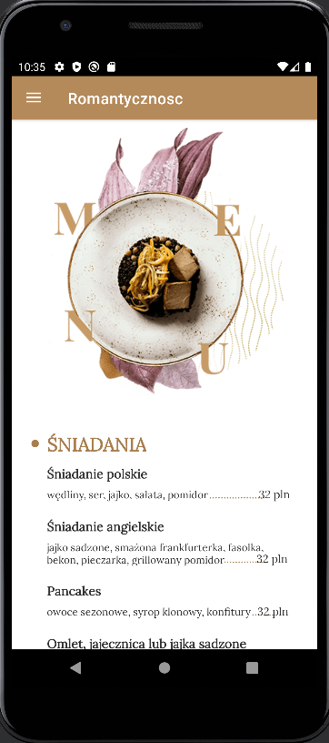
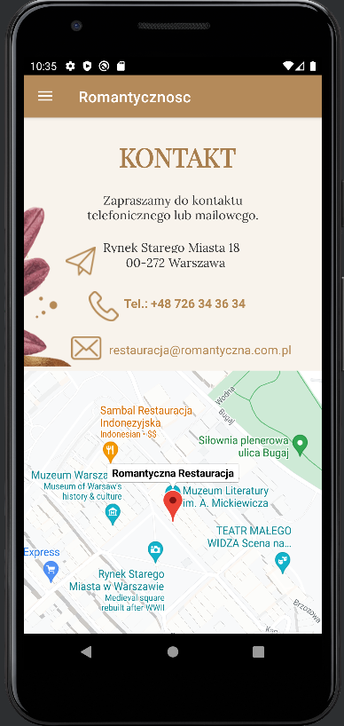

# Restauracja romantyczna

Restauracja Romantyczna to projekt zaliczeniowy napisany w języku Java w środowisku Android Studio. Wykorzystuje fragmenty i XML do tworzenia responsywnych i intuicyjnych layoutów, a także Google Maps do pokazywania położenia restauracji na mapie. Aplikacja umożliwia przeglądanie strony internetowej restauracji, zapoznanie się z jej menu oraz galerią zdjęć. Ponadto, użytkownik ma możliwość nawiązania kontaktu z restauracją za pomocą dostępnych informacji.

## Wykorzystane technologie i narzędzia
- Android Studio
- Java
- Fragmenty
- XML
- Google Maps API

## Funkcjonalności
- Przeglądanie strony internetowej restauracji
- Informacje o restauracji (historia, lokalizacja itp.)
- Przeglądanie menu z opisami i cenami
- Galeria zdjęć restauracji
- Nawiązywanie kontaktu poprzez dane kontaktowe
- Wykorzystanie Google Maps do wyświetlania lokalizacji restauracji

## Autor
Projekt został wykonany przez **Natalia Kamińska**, jako praca zaliczeniowa - Systemy mobilne. Projekt wzorowany na stronie internetowej https://romantyczna.com.pl/.

## Screenshoty

  
  
  
  
  
  

